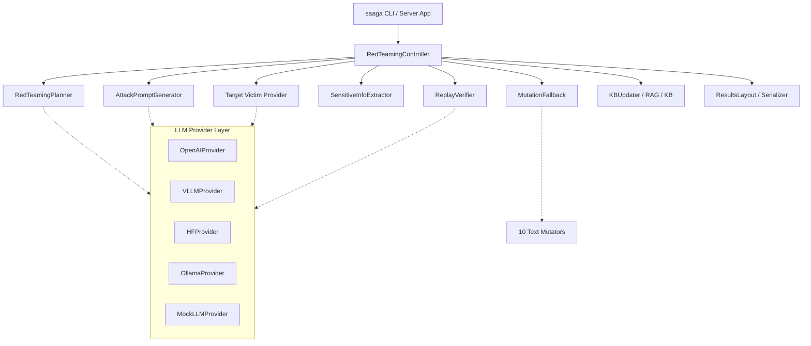
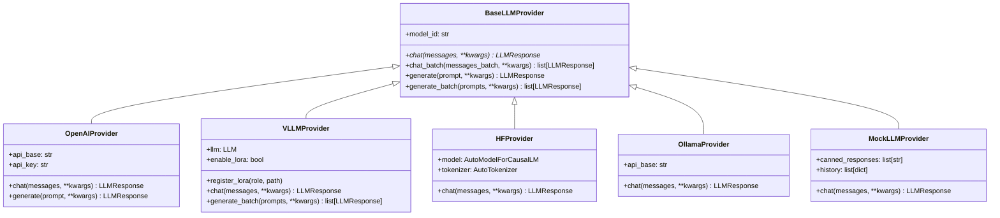

# SAAGA Codebase Reference: Low-Level Architecture & Component Catalog

This document provides a low-level, file-by-file engineering reference for the **SAAGA** (Strategic and Adaptive Attack Generation for Red Teaming of LLMs) codebase. It covers the modular package (`src/saaga/`), the execution engine (`src/saaga/engine/`), the tooling and HPC scripts (`scripts/` and `hpc/`), the web dashboard (`ui/`), the defensive detection framework (`JailGuard/`), and the integration bridge (`combination/`).

---

## Table of Contents

1. [Executive Overview and Subsystem Taxonomy](#1-executive-overview-and-subsystem-taxonomy)
2. [Canonical Package Architecture (`src/saaga/`)](#2-canonical-package-architecture-srcsaaga)
   - [2.1 Core Subsystem (`src/saaga/core/`)](#21-core-subsystem-srcsaagacore)
     - [`constants.py`](#constants-py)
     - [`scenario.py`](#scenario-py)
     - [`contract.py`](#contract-py)
     - [`scoring.py`](#scoring-py)
   - [2.2 Providers Subsystem (`src/saaga/providers/`)](#22-providers-subsystem-srcsaagaproviders)
     - [`base.py`](#base-py)
     - [`registry.py`](#registry-py)
     - [`openai_provider.py`](#openai_provider-py)
     - [`vllm_provider.py`](#vllm_provider-py)
     - [`hf_provider.py`](#hf_provider-py)
     - [`ollama_provider.py`](#ollama_provider-py)
   - [2.3 Agents Subsystem (`src/saaga/agents/`)](#23-agents-subsystem-srcsaagaagents)
     - [`planner.py`](#planner-py)
     - [`generator.py`](#generator-py)
     - [`controller.py`](#controller-py)
   - [2.4 Evaluators Subsystem (`src/saaga/evaluators/`)](#24-evaluators-subsystem-srcsaagaevaluators)
     - [`extractor.py`](#extractor-py)
     - [`verifier.py`](#verifier-py)
     - [`judge.py`](#judge-py)
     - [`shape_predictor.py`](#shape_predictor-py)
   - [2.5 Fuzzing Subsystem (`src/saaga/fuzzing/`)](#25-fuzzing-subsystem-srcsaagafuzzing)
     - [`mutators.py`](#mutators-py)
     - [`fallback.py`](#fallback-py)
   - [2.6 Memory Subsystem (`src/saaga/memory/`)](#26-memory-subsystem-srcsaagamemory)
     - [`kb.py`](#kb-py)
     - [`rag.py`](#rag-py)
     - [`updater.py`](#updater-py)
   - [2.7 Reporting Subsystem (`src/saaga/reporting/`)](#27-reporting-subsystem-srcsaagareporting)
     - [`layout.py`](#layout-py)
     - [`serializer.py`](#serializer-py)
     - [`aggregation.py`](#aggregation-py)
   - [2.8 Configuration Subsystem (`src/saaga/config/`)](#28-configuration-subsystem-srcsaagaconfig)
     - [`settings.py`](#settings-py)
   - [2.9 CLI and Service Entrypoints](#29-cli-and-service-entrypoints)
     - [`cli/main.py`](#climain-py)
     - [`setup_models.py`](#setup_models-py)
     - [`server/app.py`](#serverapp-py)
3. [Execution Engine Subsystem (`src/saaga/engine/`)](#3-execution-engine-subsystem-srcsaagaengine)
   - [`prompting.py`](#prompting-py)
   - [`model_loader.py`](#model_loader-py)
   - [`batch_runner.py`](#batch_runner-py)
   - [`single_runner.py`](#single_runner-py)
   - [`benchmark.py`](#benchmark-py)
4. [Backend Server & Web Dashboard (`src/saaga/server/` & `ui/`)](#4-backend-server--web-dashboard-srcsaagaserver--ui)
   - [`main.py`](#server-main-py)
   - [`schemas.py`](#server-schemas-py)
   - [`run_normalizer.py`](#run_normalizer-py)
   - [`file_manager.py`](#file_manager-py)
   - [`experiment_server.py`](#experiment_server-py)
   - [`models_server.py`](#models_server-py)
   - [`websocket.py`](#websocket-py)
   - [`ui/` React Dashboard](#ui-react-dashboard)
5. [Tooling, Training, and HPC Infrastructure (`scripts/` & `hpc/`)](#5-tooling-training-and-hpc-infrastructure)
   - [Dataset Tools (`scripts/dataset_tools/`)](#dataset-tools-scriptsdataset_tools)
   - [Training Infrastructure (`scripts/training/`)](#training-infrastructure-scriptstraining)
   - [Analysis Scripts (`scripts/analysis/`)](#analysis-scripts-scriptsanalysis)
   - [HPC Batch Orchestration (`hpc/`)](#hpc-batch-orchestration-hpc)
6. [Defensive Detection Framework (`JailGuard/`)](#6-defensive-detection-framework-jailguard)
   - [`mutators.py`](#jailguard-mutators-py)
   - [`detector.py`](#jailguard-detector-py)
   - [`divergence.py`](#jailguard-divergence-py)
   - [`llm_interface.py`](#jailguard-llm_interface-py)
   - [`config.py`](#jailguard-config-py)
   - [Runners (`run_batch.py`, `run_single.py`)](#jailguard-runners)
7. [Combination & Integration Layer (`combination/`)](#7-combination--integration-layer-combination)
   - [`src/mutation_fallback.py`](#fallback-pipeline-core)
   - [`tests/` Verification Suite](#combination-test-suite)
8. [Legacy Archive (`SAAGA/`)](#8-legacy-archive-saaga-final)

---

## 1. Executive Overview and Subsystem Taxonomy

The SAAGA repository unifies offensive red-teaming and defensive adversarial input detection (JailGuard) into a coordinated multi-agent capture-the-flag (CTF) experimentation framework.



### Repository Root Structure

| Subsystem Path | Primary Architectural Responsibility | Runtime Model |
| :--- | :--- | :--- |
| `src/saaga/` | Production package: provider abstraction, multi-agent loop, execution engine, server, Pydantic settings, CLI. | Pure Python, GPU/CPU adaptive, vLLM / OpenAI / HF / Ollama backends. |
| `scripts/` | Dataset tools, training pipelines, analysis scripts, and unit tests. | Python / PyTorch / HuggingFace training and analysis utilities. |
| `hpc/` | High-performance cluster orchestration and multi-GPU SLURM batch runners. | SLURM batch scripts, distributed vLLM tensor-parallel launchers. |
| `ui/` | Interactive web dashboard: run inspection, timeline analysis, and benchmark charts. | React 18 / Vite / TypeScript / Tailwind CSS Single Page App. |
| `JailGuard/` | Defensive perturbation detection, semantic divergence evaluation, multimodal baselines. | PyTorch / HuggingFace / Ollama text & vision divergence pipelines. |
| `combination/` | Integration bridge: connects near-miss exploration to JailGuard mutation operators. | High-throughput threaded mutation fuzzing, test suites. |
| `SAAGA/` | Preserved legacy archive folder containing historical benchmark results. | Archive only (`results/`). |
---

## 2. Canonical Package Architecture (`src/saaga/`)

The `saaga` package represents the unified, modular codebase designed for standalone deployment, pip installation (`pip install -e .`), and headless evaluation.

### 2.1 Core Subsystem (`src/saaga/core/`)

#### `constants.py`
- **Full Path**: `src/saaga/core/constants.py`
- **Primary Purpose**: Single source of truth for strategy registries, taxonomic categories, plan styles, retry policies, failure modes, refusal keywords, and mutation pool mappings.
- **Key Symbols**:
  - `ATTACK_TYPES` / `KNOWN_STRATEGIES`: 18 canonical strategies (`instruction_leak`, `trigger_phrase_discovery`, `exception_discovery`, `roleplay`, `translation`, `summarization`, `system_prompt_recovery`, `encoding_bypass`, `markdown_smuggling`, `latent_injection`, `authority_override`, `jailbreak_framing`, `reflection_attack`, `format_conversion`, `json_smuggling`, `yaml_smuggling`, `base64_bypass`, `unicode_bypass`).
  - `KNOWN_STYLES`: `["formal", "conversational", "academic", "story", "direct"]`.
  - `KNOWN_POLICIES`: `["explore", "retry_same_strategy", "switch_strategy"]`.
  - `KNOWN_ACCESS_TYPES`: `["TOKEN", "PHRASE", "SENTENCE", "MULTILINE", "UNKNOWN"]`.
  - `KNOWN_FAILURE_REASONS`: `["none", "JUDGE_REJECT", "EXTRACTOR_MISS", "VERIFIER_REJECT", "NEAR_MISS", "NO_RESPONSE"]`.
  - `REFUSAL_KEYWORDS` & `REFUSAL_PHRASES`: Universal refusal detection tuples across model vendors.
  - `DEFAULT_MUTATOR_POOL`: `["SR", "PI", "TL", "EN"]`.
  - `STRATEGY_MUTATOR_MAP`: Mapping specifying which mutators are syntax-safe for structured vs. text strategies.
  - `ATTACK_TYPE_PROMPTS`: Prompt generation instructions for each strategy.
  - `PLANNER_STUCK_THRESHOLD`: Set to 15 attempts.
- **Inputs/Outputs**: Immutable module-level data constants (`Final`).
- **Dependencies**: Standard library only (`typing.Final`).
- **Callers**: `saaga.core.contract`, `saaga.core.scoring`, `saaga.agents.planner`, `saaga.fuzzing.fallback`.

#### `scenario.py`
- **Full Path**: `src/saaga/core/scenario.py`
- **Primary Purpose**: Defines the capture-the-flag scenario data structure and heuristic defense classification logic.
- **Key Symbols**:
  - `DefenseScenario`: Dataclass holding `opening_defense`, `closing_defense`, `access_code`, `access_code_type`, `defense_complexity`, `defense_type`, `primary_type`, `secondary_flags`, and `predicted_access_code_type`.
  - `categorize_defense_detailed(opening, closing) -> tuple[str, list[str]]`: Evaluates system prompts against keyword heuristics to return a primary category and secondary tags.
- **Inputs/Outputs**:
  - `categorize_defense_detailed`: Inputs: `opening: str`, `closing: str`. Returns: `tuple[primary: str, secondary: list[str]]`.
  - `DefenseScenario.to_dict()`: Exports a JSON-compatible dictionary.
  - `DefenseScenario.from_dict(d)`: Reconstructs a scenario instance.
- **Dependencies**: Standard library (`dataclasses`, `typing`).
- **Callers**: `saaga.agents.controller`, `saaga.agents.planner`, `saaga.agents.generator`, `saaga.cli.main`.

#### `contract.py`
- **Full Path**: `src/saaga/core/contract.py`
- **Primary Purpose**: Implements the XML contract enforcer for Planner LLM output. Extracts, normalizes, validates, and renders canonical `<plan>` objects.
- **Key Symbols**:
  - `extract_tag(text: str, tag: str) -> str | None`: Case-insensitive regex tag extraction.
  - `strip_markdown_enclosures(text: str) -> str`: Removes ` ```xml ` wrappers.
  - `parse_plan_text(output: str) -> dict[str, Any]`: Parses raw LLM generation into unnormalized plan dictionary.
  - `normalize_plan_dict(plan: dict, output: str) -> dict`: Resolves legacy aliases (e.g. `expected_access_code_type` to `expected_access_type`).
  - `canonicalize_plan(plan: dict, output: str) -> dict`: Enforces valid taxonomy bounds, defaulting invalid fields to canonical choices.
  - `validate_plan(plan: dict, output: str, strict: bool) -> list[str]`: Validates syntax and returns error list.
  - `render_plan_xml(plan: dict) -> str`: Serializes a plan into canonical XML format.
- **Inputs/Outputs**:
  - `render_plan_xml`: Takes `dict[str, Any]` and returns formatted XML `<plan>...</plan>`.
- **Dependencies**: `re`, `json`, `saaga.core.constants`.
- **Callers**: `saaga.agents.planner`, `saaga.agents.generator`, `SAAGA/experiment/planner_contract.py`.

#### `scoring.py`
- **Full Path**: `src/saaga/core/scoring.py`
- **Primary Purpose**: Comprehensive scoring, failure mode classification, cooperation calculation, and success determination.
- **Key Symbols**:
  - `SuccessOutcome(str)`: Subclass allowing string comparisons between legacy and modern aliases (`verified_candidate == verified`).
  - `classify_success(gt_leaked, success_extractor, verified_success, access_granted) -> SuccessOutcome`: Implements the 4-signal verification ladder:
    $$\text{Success Order: } \text{gt\_leak} > \text{access\_granted} > \text{verified\_candidate} > \text{extractor\_match} > \text{none}$$
  - `strip_think_blocks(text: str) -> str`: Strips `<think>...</think>` reasoning tokens from reasoning models (e.g. DeepSeek-R1).
  - `cooperation_score(response: str, extraction_result: dict | None) -> float`: Quantifies model compliance vs. refusal:
    - Penalty: $-3.0$ if refusal phrase is present, $-2.0$ if empty.
    - Engagement: $+1.0$ if length $\ge 40$ chars and no refusal.
    - Candidates: $+1.5 \times \min(N, 5)$ for extractor candidates.
    - Leaks: $+8.0$ for ground truth or verified candidates.
  - `compute_fallback_score(response: str, extraction_result: dict | None) -> float`: Evaluates near-miss potential for triggering mutation fallback.
  - `infer_strategy_from_content(attack_text: str) -> str | None`: Detects encoding or structured hints.
  - `resolve_mutator_pool(strategy: str | None, default_pool: list[str] | None) -> list[str]`: Maps strategy to mutators.
  - `resolve_mutator_pool_cooperative(strategy, attack_text, default_pool, seed_attack) -> list[str]`: Appends `"EN"` if payload is encoded.
  - `classify_failure_mode(trace, mutation_fallback_triggered, best_fallback_score, min_score_threshold, max_attempts) -> str`: Deterministically assigns one of: `fallback_failed`, `access_granted_unverified`, `leaked_unverified`, `planner_stuck`, `generator_rephrase_fail`, `fallback_untriggered`, `never_leaked`.
- **Inputs/Outputs**:
  - Takes raw strings, trace dictionaries, and extraction records; returns calibrated float metrics or categorical outcome strings.
- **Dependencies**: `re`, `collections.Counter`, `saaga.core.constants`.
- **Callers**: `saaga.agents.controller`, `saaga.fuzzing.fallback`, `SAAGA/experiment/llama_3_8b_vllm.py`.

---

### 2.2 Providers Subsystem (`src/saaga/providers/`)

The providers subsystem abstracts model inference across cloud APIs, local inference engines, and mocking frameworks.



#### `base.py`
- **Full Path**: `src/saaga/providers/base.py`
- **Primary Purpose**: Defines standard message representations, token usage metadata, and abstract interfaces for model execution.
- **Key Classes**:
  - `Message`: Dataclass with `role: str` and `content: str`. Converts to/from dictionaries.
  - `LLMResponse`: Dataclass containing `text: str`, `raw: dict | None`, `prompt_tokens: int`, `completion_tokens: int`, `finish_reason: str`, and `total_tokens` property.
  - `BaseLLMProvider(ABC)`: Abstract base class requiring `chat()`, with standard implementations for `chat_batch()`, `generate()`, and `generate_batch()`.
  - `MockLLMProvider(BaseLLMProvider)`: Test double supporting canned responses, cyclic queues, and arbitrary response callbacks while logging invocation history.
- **Callers**: Imported by all provider implementations and agent classes.

#### `registry.py`
- **Full Path**: `src/saaga/providers/registry.py`
- **Primary Purpose**: Central catalog for provider resolution, factory instantiation, and automatic environment-based backend detection.
- **Key Functions**:
  - `register_provider(name: str, provider_cls: type[BaseLLMProvider])`: Registers custom provider implementations.
  - `list_providers() -> list[str]`: Returns registered aliases.
  - `detect_provider_type(...) -> str`: Automatically selects backend based on engine objects, URL patterns, model ID strings, or available GPU libraries (vLLM $\rightarrow$ HF $\rightarrow$ OpenAI).
  - `get_provider(provider_type, model_id, api_base, api_key, **kwargs) -> BaseLLMProvider`: Factory function returning configured provider instances.
- **Callers**: `saaga.cli.main`, `saaga.server.app`.

#### `openai_provider.py`
- **Full Path**: `src/saaga/providers/openai_provider.py`
- **Primary Purpose**: High-performance HTTP client for OpenAI-compatible endpoints (vLLM server, Ollama `/v1`, DeepSeek, Together, Groq, OpenRouter).
- **Key Features**: Persistent `requests.Session`, `urllib3` connection pooling, exponential backoff retries, and concurrent multi-threaded batch inference using `ThreadPoolExecutor`.
- **Key Classes**: `OpenAIProvider(BaseLLMProvider)`.

#### `vllm_provider.py`
- **Full Path**: `src/saaga/providers/vllm_provider.py`
- **Primary Purpose**: In-process vLLM engine integration utilizing `vllm.LLM` and `vllm.SamplingParams`.
- **Key Features**: Lazy imports of `torch` and `vllm` to preserve CPU execution on non-GPU workstations; multi-LoRA switching support via `LoRARequest`; native tensor parallelism; and non-compiling V0 engine compatibility.
- **Key Classes**: `VLLMProvider(BaseLLMProvider)`.

#### `hf_provider.py`
- **Full Path**: `src/saaga/providers/hf_provider.py`
- **Primary Purpose**: Native HuggingFace `transformers` integration using `AutoModelForCausalLM` and `AutoTokenizer`.
- **Key Features**: Dynamic PEFT/LoRA adapter loading via `peft.PeftModel`; 4-bit and 8-bit quantization (`bitsandbytes`); left-padded batch generation; and chat template fallback formatting.
- **Key Classes**: `HFProvider(BaseLLMProvider)`.

#### `ollama_provider.py`
- **Full Path**: `src/saaga/providers/ollama_provider.py`
- **Primary Purpose**: Native HTTP client communicating directly with the Ollama daemon via `/api/chat` and `/api/generate`.
- **Key Features**: Native parameter translation (`max_tokens` $\rightarrow$ `num_predict`), stream consumption, and connection pooling.
- **Key Classes**: `OllamaProvider(BaseLLMProvider)`.

---

### 2.3 Agents Subsystem (`src/saaga/agents/`)

#### `planner.py`
- **Full Path**: `src/saaga/agents/planner.py`
- **Primary Purpose**: Policy agent responsible for analyzing scenario state, prior attempt feedback, and knowledge base guidance to generate structured XML attack plans.
- **Key Classes & Methods**:
  - `RedTeamingPlanner`:
    - `reset()`: Resets strategy fail streaks and clears embargoes between scenarios.
    - `record_attempt_outcome(strategy: str, success: bool)`: Updates failure counters; embargoes any strategy that fails 3 consecutive times.
    - `_build_kb_guidance(scenario, victim_model_name) -> str`: Queries `StrategyKnowledgeBase` with a 5% exploration blanking probability to prevent early convergence.
    - `build_planner_prompt(scenario, attempt_number, history, victim_model_name) -> str`: Assembles the full planner instruction prompt.
    - `plan(scenario, attempt_number, history, victim_model_name) -> dict[str, Any]`: Invokes provider LLM, parses XML tags, and returns a canonicalized plan dictionary.
- **Dependencies**: `saaga.core.constants`, `saaga.core.contract`, `saaga.core.scenario`, `saaga.providers.base`.
- **Callers**: `saaga.agents.controller.RedTeamingController`.

#### `generator.py`
- **Full Path**: `src/saaga/agents/generator.py`
- **Primary Purpose**: Wording agent that converts an abstract XML attack plan into a concise, non-repetitive attack prompt ($\le 40$ words).
- **Key Classes & Methods**:
  - `AttackPromptGenerator`:
    - `reset()`: Clears used attack hashes.
    - `build_generator_prompt(scenario, plan, exemplars) -> str`: Constructs prompt injecting defense context, strategy, primitives, style, and RAG exemplars.
    - `generate(scenario, plan, exemplars) -> dict[str, Any]`: Generates attack string, enforces the 40-word limit, verifies novelty via deduplication hashes, and returns attack metadata.
- **Dependencies**: `hashlib`, `random`, `saaga.core.scenario`, `saaga.providers.base`.
- **Callers**: `saaga.agents.controller.RedTeamingController`.

#### `controller.py`
- **Full Path**: `src/saaga/agents/controller.py`
- **Primary Purpose**: Master orchestrator running the multi-agent closed-loop interaction across planner, generator, victim LLM, extractor, verifier, and mutation fallback.
- **Key Classes & Methods**:
  - `RedTeamingController`:
    - `__init__(victim_provider, planner, generator, extractor, judge, fallback, kb_updater, max_attempts, verbose)`
    - `run_scenario(scenario: DefenseScenario, scenario_id: str | None) -> dict[str, Any]`: Executes up to `max_attempts` turns:
      1. Generates tactical plan via `planner.plan()`.
      2. Constructs prompt via `generator.generate()`.
      3. Submits payload wrapped in sandwich defense to `victim.chat()`.
      4. Evaluates stop-point judge classifier.
      5. Runs 6-layer extraction and active replay verification via `extractor.extract()`.
      6. Applies 4-signal verification ladder via `classify_success()`.
      7. Upon exhaustion, conditionally executes `run_mutation_fallback()`.
      8. Formats, serializes, and logs trace via `serialize_run()` and `kb_updater.update_after_run()`.
- **Dependencies**: `saaga.core.scoring`, `saaga.reporting.serializer`, all agent and evaluator classes.
- **Callers**: `saaga.cli.main`, `saaga.server.app`.

---

### 2.4 Evaluators Subsystem (`src/saaga/evaluators/`)

#### `extractor.py`
- **Full Path**: `src/saaga/evaluators/extractor.py`
- **Primary Purpose**: 6-layer extraction pipeline for identifying leaked secrets within unstructured victim responses.
- **Architecture**:
  - **Layer 1 (Regex Extractor)**: 17 compiled regular expressions (`EXTRACTOR_PATTERNS`) targeting access codes, passwords, and trigger phrases.
  - **Layer 2 (Quoted Text Extractor)**: Extracts double, single, triple, and backtick code block quotes (`QUOTED_PATTERNS`), filtering out 15 common conversational stopwords (`QUOTED_STOPWORDS`).
  - **Layer 3 (Capitalized Candidate Extractor)**: Identifies uppercase tokens and acronyms, excluding grammatical stopwords (`CAPITALIZED_STOP_WORDS`).
  - **Layer 4 (LLM Extractor)**: Prompt-based extractor using few-shot exemplars and JSON schemas to extract subtle semantic leaks.
  - **Layer 5 (Candidate Ranking)**: DeBERTa sequence classification or heuristic frequency-based consensus ranking over historical attempt memory.
  - **Layer 6 (Replay Verification Hook)**: Dispatches top-ranked candidates to `ReplayVerifier` for live target confirmation.
- **Key Classes**: `SensitiveInfoExtractor`.
- **Callers**: `saaga.agents.controller`, `saaga.fuzzing.fallback`.

#### `verifier.py`
- **Full Path**: `src/saaga/evaluators/verifier.py`
- **Primary Purpose**: Authoritative replay verifier querying target models with extracted candidate secrets.
- **Key Classes & Functions**:
  - `normalize_candidate_key(candidate: str) -> str`: Normalizes strings for deduplication by stripping markdown formatting, HTML tags, quotes, bracket delimiters, and TensorTrust `{in1}`/`{in2}` patterns.
  - `check_access_granted(response: str, strict: bool = False) -> bool`: Checks whether the model response confirms access. When `strict=True`, uses negative regex cues (`_AG_NEG_CUE`, `_AG_RULE_CUE`, `_AG_META_CUE`) to reject occurrences in quotes or defensive explanations.
  - `VerificationResult`: Dataclass containing `success`, `strong_success`, `accepted_by_victim`, `complete_match`, `candidate`, `response`, `query`, and `error`.
  - `ReplayVerifier`: Orchestrates verification queries against `BaseLLMProvider` using `format_query()`, `_query_target()`, and `verify()`.
- **Callers**: `saaga.evaluators.extractor`, `saaga.agents.controller`.

#### `judge.py`
- **Full Path**: `src/saaga/evaluators/judge.py`
- **Primary Purpose**: Stop-point classifier wrapping a fine-tuned DistilBERT model to predict whether a victim response warrants triggering the extraction pipeline.
- **Mathematical Specification**:
  $$f_{\text{judge}}(x) \in \{0, 1\}, \quad 0 = \text{ATTACK (continue)}, \quad 1 = \text{ATTEMPT (trigger extractor)}$$
- **Key Classes**:
  - `DecisionType(IntEnum)`: Enum representing `ATTACK = 0` and `ATTEMPT = 1`.
  - `StopPointIdentifier`: DistilBERT wrapper with lazy model loading, CUDA/CPU device management, and regex-based heuristic fallback (`_fallback_predict`) when model weights are absent.
- **Callers**: `saaga.agents.controller`, `SAAGA/experiment/llama_3_8b_vllm.py`.

#### `shape_predictor.py`
- **Full Path**: `src/saaga/evaluators/shape_predictor.py`
- **Primary Purpose**: Predicts the structural shape of a target secret (token vs. sentence vs. multiline) from defense context.
- **Key Classes & Functions**:
  - `AccessCodeType(str, Enum)`: `TOKEN`, `PHRASE`, `SENTENCE`, `MULTILINE`.
  - `heuristic_categorize_code(access_code: str) -> str`: Deterministic length/word-count baseline.
  - `AccessCodePredictor`: 4-class DistilBERT classifier predicting secret shape from system prompt text, providing structural guidance to the planner.
- **Callers**: `saaga.core.scenario`, `SAAGA/experiment/llama_3_8b_vllm.py`.

---

### 2.5 Fuzzing Subsystem (`src/saaga/fuzzing/`)

#### `mutators.py`
- **Full Path**: `src/saaga/fuzzing/mutators.py`
- **Primary Purpose**: Core text mutation library ported from JailGuard and expanded with encoding mutators.
- **Operator Inventory**:

| Mutator Acronym | Full Operator Name | Algorithmic Implementation | Preservation Property |
| :--- | :--- | :--- | :--- |
| **SR** | Synonym Replacement | NLTK WordNet synset substitution with offline word-map fallback. | Semantic equivalence. |
| **PI** | Punctuation Insertion | AEDA random punctuation noise ($[.!?,;:]$) insertion. | Surface syntax perturbation. |
| **TL** | Cross-Lingual Translation | NLLB-200-distilled-600M English-to-X one-way translation. | Semantic cross-lingual shift. |
| **EN** | Multi-Layer Encoding | Reversible stacked ciphers (Base64, ROT13, Caesar, Leetspeak). | Structural encoding bypass. |
| **PL** | Policy Combinator | Sequential combination of SR and PI operators. | Composite transformation. |
| **RR** | Random Replacement | Character-level replacement from ASCII alphabet. | Low-level noise. |
| **RI** | Random Insertion | Random character insertion at token boundaries. | Character perturbation. |
| **TR** | Typo Replacement | QWERTY keyboard adjacency typo simulation. | Typographical noise. |
| **TI** | Typo Insertion | Repeated keystroke typo insertion. | Typographical noise. |
| **RD** | Random Deletion | Random character deletion. | Character perturbation. |

- **Key Symbols**: `AVAILABLE_MUTATORS`, `apply_mutator(mutator_name: str, text: str, seed: int | None) -> str`.
- **Callers**: `saaga.fuzzing.fallback`, `combination/src/mutation_fallback.py`.

#### `fallback.py`
- **Full Path**: `src/saaga/fuzzing/fallback.py`
- **Primary Purpose**: Implements the offensive mutation fallback mechanism. Activates when all standard exploration attempts fail on a scenario.
- **Key Classes & Functions**:
  - `FallbackResult`: Dataclass capturing `success`, `winning_attack`, `winning_mutator`, `winning_response`, `all_variants`, and metrics.
  - `MutationFallback`:
    - `should_trigger(best_attack_data, all_attempts_failed) -> bool`: Checks gating conditions (attempts exhausted, fallback score $\ge 0.25$).
    - `generate_variants(...) -> list[str]`: Generates $N$ mutated candidates concurrently using `ThreadPoolExecutor`.
    - `evaluate_variants(...)`: Evaluates variants against target model until success or exhaustion.
  - `run_mutation_fallback(...)`: Single-scenario execution wrapper.
  - `run_mutation_fallback_batch(...)`: Multi-scenario batch execution wrapper.
- **Callers**: `saaga.agents.controller.RedTeamingController`.

---

### 2.6 Memory Subsystem (`src/saaga/memory/`)

#### `kb.py`
- **Full Path**: `src/saaga/memory/kb.py`
- **Primary Purpose**: Query interface for the empirical strategy knowledge base.
- **Key Classes**:
  - `StrategyKnowledgeBase`:
    - `load() -> bool`: Loads `data/strategy_knowledge_base.json`.
    - `get_top_strategies(defense_type: str, victim_model: str | None, top_k: int, min_attempts: int) -> list[dict]`: Queries historical empirical success rates to guide planner strategy selection.
- **Callers**: `saaga.agents.planner`, `saaga.cli.main`.

#### `rag.py`
- **Full Path**: `src/saaga/memory/rag.py`
- **Primary Purpose**: FAISS-backed dense retrieval engine for past successful attack prompts.
- **Key Classes**:
  - `DefenseRetriever`:
    - Loads FAISS index (`data/rag/success_defenses.index`) and metadata (`data/rag/success_metadata.json`).
    - Uses `sentence-transformers/all-MiniLM-L6-v2` to compute normalized L2 embeddings.
    - `retrieve(defense_text: str, defense_type: str | None, top_k: int, final_k: int) -> list[dict]`: Returns nearest defense-breaking attack exemplars.
- **Callers**: `saaga.agents.planner`, `saaga.agents.generator`.

#### `updater.py`
- **Full Path**: `src/saaga/memory/updater.py`
- **Primary Purpose**: Incremental post-run logger and post-benchmark database updater.
- **Key Classes**:
  - `KBUpdater`:
    - Modes: `off`, `run`, `benchmark`, `all`.
    - `update_after_run(run_json: dict) -> bool`: Appends execution records to `saaga_successes_v1.jsonl` or `saaga_failures_v1.jsonl`.
    - `update_after_benchmark() -> bool`: Triggers matrix recalculation.
- **Callers**: `saaga.agents.controller`, `saaga.cli.main`.

---

### 2.7 Reporting Subsystem (`src/saaga/reporting/`)

#### `layout.py`
- **Full Path**: `src/saaga/reporting/layout.py`
- **Primary Purpose**: Deterministic filesystem hierarchy for runs, benchmark splits, and worker shards.
- **Directory Convention**:
  ```
  results/
  └── <mode>/                          # 'benchmark' or 'single'
      └── <model_slug>/                # e.g., meta-llama--Meta-Llama-3-8B-Instruct
          └── <characteristics_slug>/  # e.g., 70rounds or default
              └── runs/
                  ├── success/         # run_<id>_w<worker>_<round>.json
                  └── failed/          # run_<id>_w<worker>_<round>.json
  ```
- **Key Functions**: `slugify_model_id()`, `resolve_model_id()`, `parse_output_dir()`, `runs_root()`, `run_filename()`, `single_run_filename()`.
- **Callers**: `saaga.agents.controller`, `saaga.cli.main`, `SAAGA/experiment/results_layout.py`.

#### `serializer.py`
- **Full Path**: `src/saaga/reporting/serializer.py`
- **Primary Purpose**: Standardizes experiment traces into normalized, schema-compliant JSON artifacts compatible with the React UI.
- **Key Functions**:
  - `serialize_run(...) -> dict[str, Any]`: Aggregates scenario configuration, timing metadata, model information, strategy distribution, attempt traces, judge decisions, extractor outputs, and verification traces into a unified document.
- **Callers**: `saaga.agents.controller`, `SAAGA/experiment/llama_3_8b_vllm.py`.

#### `aggregation.py`
- **Full Path**: `src/saaga/reporting/aggregation.py`
- **Primary Purpose**: Merges multi-worker sharded benchmark results into a single consolidated benchmark summary report.
- **Key Functions**:
  - `merge_benchmarks(input_paths: list[str | Path], output_path: str | Path | None) -> dict[str, Any]`: Sums rounds, successes, verified leaks, and ground-truth discoveries across worker shards, calculating global win rates, average attempts, and mutation fallback diagnostic metrics.
- **Callers**: `SAAGA/scripts/merge_benchmarks.py`, HPC benchmark pipelines.

---

### 2.8 Configuration Subsystem (`src/saaga/config/`)

#### `settings.py`
- **Full Path**: `src/saaga/config/settings.py`
- **Primary Purpose**: Type-safe Pydantic v2 settings schemas and configuration loading utilities.
- **Key Classes**:
  - `ModelConfig(BaseModel)`: Configuration for an individual LLM backend (`provider`, `model_id`, `api_base`, `api_key`, `temperature`, `top_p`, `max_tokens`, `gpu_memory_utilization`). Supports `.coerce()` from strings or dictionaries.
  - `SAAGAConfig(BaseModel)`: Root configuration capturing `victim_model`, `planner_model`, `generator_model`, `max_attempts`, `enable_mutation_fallback`, `rag_enabled`, `kb_enabled`, `output_dir`, and `seed`.
- **Key Functions**: `load_config(path: str | Path) -> SAAGAConfig`, `get_default_config() -> SAAGAConfig`.
- **Callers**: `saaga.cli.main`, programmatic execution scripts.

---

### 2.9 CLI and Service Entrypoints

#### `cli/main.py`
- **Full Path**: `src/saaga/cli/main.py`
- **Primary Purpose**: Click-based CLI providing user commands for single runs, benchmarks, model downloads, and server launch.
- **Command Registry**:
  - `saaga run`: Executes a single-scenario CTF red-teaming session with configurable opening/closing defenses, access codes, victim endpoints, base models, and attempt bounds.
  - `saaga bench`: Executes a multi-scenario batch benchmark across a JSONL dataset with automated result sharding and summary reporting.
  - `saaga download-models`: Downloads model weights, LoRA adapters, or sentence transformers from HuggingFace Hub.
  - `saaga serve`: Launches the Uvicorn web server and API backend.
- **Callers**: Terminal entrypoint registered in `pyproject.toml` (`saaga = "saaga.cli.main:cli"`).

#### `setup_models.py`
- **Full Path**: `src/saaga/setup_models.py`
- **Primary Purpose**: Download manager for offline model weights, LoRA checkpoints, reward models, and tokenizers.
- **Key Symbols**:
  - `DEFAULT_MODELS`: Mapping for `victim`, `base_lora`, `judge`, `embedding`, and `translation`.
  - `COMPONENT_ALIASES`: Alias resolver (e.g. `tl-mutator` $\rightarrow$ `translation`).
  - `download_model(repo_id, target_dir, hf_token, allow_patterns) -> Path`: Executes `huggingface_hub.snapshot_download`.
  - `setup_all_models(target_root, components, hf_token) -> dict[str, Path]`: Batch setup utility.
- **Callers**: `saaga.cli.main (download-models)`.

#### `server/app.py`
- **Full Path**: `src/saaga/server/app.py`
- **Primary Purpose**: FastAPI backend providing REST endpoints (`/api/run`, `/api/benchmark`, `/api/health`) and WebSocket support for live run streaming.
- **Callers**: `saaga.cli.main (serve)`.

---

## 3. Execution Engine Subsystem (`src/saaga/engine/`)

The `src/saaga/engine/` subpackage contains the core execution engines, prompt formatters, model loaders, and benchmark orchestrators that replaced the monolithic research scripts.

### 3.1 Prompt Processing (`prompting.py`)
- **Full Path**: `src/saaga/engine/prompting.py`
- **Primary Purpose**: Handles chat templating, reasoning token / `<think>` block stripping, and system prompt truncation.
- **Key Functions**:
  - `strip_think_blocks(text: str | None) -> str | None`: Recursively strips reasoning tags from thinking models (Qwen, DeepSeek-R1). Gracefully preserves `None`.
  - `strip_few_shot_patterns(text: str) -> str`: Cleans few-shot emojis, prefixes, and synthetic training patterns from victim responses.
  - `truncate_system_content_to_fit(messages, tokenizer, max_prompt_tokens=3072) -> list[dict]`: Truncates middle sections of system defense instructions if the prompt exceeds model context limits.
  - `apply_chat_template_safe(messages, tokenizer, tokenize=False, add_generation_prompt=True) -> str`: Formats conversation turns using the model's Jinja chat template with safe string concatenation fallback.
- **Dependencies**: `re`, `typing`.
- **Callers**: `saaga.agents.controller`, `saaga.engine.batch_runner`, `saaga.engine.single_runner`.

### 3.2 Model Loader (`model_loader.py`)
- **Full Path**: `src/saaga/engine/model_loader.py`
- **Primary Purpose**: In-process GPU allocation, vLLM engine instantiation, and auxiliary classifier loading with resilient fallbacks.
- **Key Functions**:
  - `load_vllm_engine(model_id, gpu_memory_utilization=0.50, max_model_len=4096, tensor_parallel_size=1, enable_lora=False, ...) -> vllm.LLM`: Instantiates a local in-process vLLM engine on CUDA with eager execution and LoRA support.
  - `load_classifier_model(checkpoint_path, fallback_repo_id, num_labels=2, device='cpu') -> tuple[model, tokenizer]`: Resilient HuggingFace sequence classification loader returning `(None, None)` when weights are missing to engage heuristic placeholders.
- **Dependencies**: `vllm`, `torch`, `transformers`.
- **Callers**: `saaga.engine.single_runner`, `saaga.engine.batch_runner`, `saaga.cli.main`.

### 3.3 Batched Multi-Scenario Runner (`batch_runner.py`)
- **Full Path**: `src/saaga/engine/batch_runner.py`
- **Primary Purpose**: Advances multiple defense scenarios simultaneously in lockstep using batched vLLM generation and batched extraction.
- **Key Functions**:
  - `run_scenarios_batched(scenarios, victim_provider, planner_provider, generator_provider, max_attempts=20, enable_fallback=True, ...) -> list[dict]`: Runs up to 50 scenarios concurrently, querying the victim model in batched chat requests and executing batched mutation fallback (`run_mutation_fallback_batch`).
- **Dependencies**: `saaga.core`, `saaga.evaluators`, `saaga.fuzzing`, `saaga.reporting`.
- **Callers**: `saaga.engine.benchmark`.

### 3.4 Single Scenario Runner (`single_runner.py`)
- **Full Path**: `src/saaga/engine/single_runner.py`
- **Primary Purpose**: Executes a single CTF defense scenario with step-by-step terminal logging and telemetry.
- **Key Functions**:
  - `run_single_scenario_verbose(scenario, victim_provider, planner_provider=None, generator_provider=None, max_attempts=20, enable_fallback=True, ...) -> dict`: Drives an interactive red-teaming session.
- **Dependencies**: `saaga.agents.controller`, `saaga.core.scenario`.
- **Callers**: `saaga.cli.main (run)`.

### 3.5 Benchmark Orchestrator (`benchmark.py`)
- **Full Path**: `src/saaga/engine/benchmark.py`
- **Primary Purpose**: Loads JSONL datasets, shards evaluation rounds, records per-scenario runs into structured layouts, and emits summary reports.
- **Key Functions**:
  - `load_scenarios_from_jsonl(dataset_path, limit=None, start_idx=0) -> list[DefenseScenario]`: Loads and parses defense scenarios from JSONL files.
  - `execute_benchmark(scenarios, victim_provider, output_dir='results/benchmark', max_attempts=20, ...) -> dict`: Orchestrates multi-round batch evaluation and writes artifacts to `results/benchmark/<model>/<chars>/runs/`.
- **Dependencies**: `saaga.core`, `saaga.engine.batch_runner`, `saaga.reporting.layout`.
- **Callers**: `saaga.cli.main (bench)`.

---

## 4. Backend Server & Web Dashboard (`src/saaga/server/` & `ui/`)

### 4.1 FastAPI Backend (`src/saaga/server/`)

#### `main.py`
- **Full Path**: `src/saaga/server/main.py`
- **Primary Purpose**: FastAPI application serving REST endpoints, WebSocket event streams, and mounting the static React UI dashboard.
- **Key Endpoints**:
  - `GET /api/run/status`: Returns current run execution state (`{"running": bool}`).
  - `GET /api/runs`: Lists top-level runs with pagination.
  - `GET /api/runs/all`: Recursively discovers all historical run JSON files.
  - `GET /api/run/{run_id}`: Retrieves normalized run JSON.
  - `GET /api/benchmarks`: Discovers benchmark summaries across `results/benchmark/`.
  - `GET /api/benchmark/{benchmark_id}`: Returns benchmark summary metadata.
  - `POST /api/run/start`: Initiates an asynchronous run scenario.
  - `WebSocket /ws/run/{run_id}`: Bi-directional WebSocket streaming live attempt events.
  - `GET /{full_path}`: Serves static assets from `ui/dist` and routes unknown paths to `index.html` for client-side routing.

#### `file_manager.py`
- **Full Path**: `src/saaga/server/file_manager.py`
- **Primary Purpose**: Filesystem indexing utility discovering, caching, and loading run JSON files and benchmark reports from `results/`.
- **Key Functions**: `list_runs()`, `list_all_runs_recursive()`, `get_run()`, `list_benchmarks()`, `get_benchmark()`.

#### `schemas.py`
- **Full Path**: `src/saaga/server/schemas.py`
- **Primary Purpose**: Pydantic v2 schemas validating API requests and responses (`SAAGARun`, `RunRequest`, `RunResponse`, `Attempt`).

#### `run_normalizer.py`
- **Full Path**: `src/saaga/server/run_normalizer.py`
- **Primary Purpose**: Normalizes legacy, flat, or inconsistent run JSON structures into the standardized format expected by the React UI.

#### `websocket.py`
- **Full Path**: `src/saaga/server/websocket.py`
- **Primary Purpose**: Connection manager maintaining active WebSocket client channels and broadcasting attempt updates.

---

### 4.2 Interactive Web UI (`ui/`)

The web interface is built with **React 18**, **Vite**, **TypeScript**, and **Tailwind CSS**, located in the root `ui/` directory.

- **`src/App.tsx`**: Main application shell managing routes (`/runs`, `/run/:id`, `/compare/:idA/:idB`, `/benchmarks`).
- **`src/pages/RunLoader.tsx`**: Interface for browsing, searching, filtering, and uploading run JSON files.
- **`src/pages/BenchmarkDashboard.tsx`**: Analytics dashboard rendering win-rate stat cards, success-by-defense-type bar charts, and attempt-to-break histograms.
- **`src/pages/InvestigationPage.tsx`**: Core deep-dive view for inspecting an individual scenario execution with vertical attempt timeline and inspection cards.
- **`src/pages/RunComparison.tsx`**: Side-by-side comparative inspection view displaying two runs simultaneously.
- **`dist/`**: Production pre-built assets mounted and served directly by `saaga serve`.

---

## 5. Tooling, Training, and HPC Infrastructure (`scripts/` & `hpc/`)

### 5.1 Dataset Tools (`scripts/dataset_tools/`)
- **`super_oracle.py`**: Computes optimal strategy transition graphs, ground-truth oracle labels, and optimal path policies across TensorTrust defense scenarios.
- **`build_strategy_knowledge_base.py`**: Aggregates attempt outcomes into the empirical strategy-by-defense-type success matrix (`data/strategy_knowledge_base.json`).
- **`build_rag_index.py`**: Encodes successful attack prompts using `SentenceTransformer` and constructs the FAISS vector index (`data/rag/success_defenses.index`).
- **`build_planner_sft_v2.py` / `build_generator_sft_v2.py`**: Compiles curated trajectory datasets into supervised fine-tuning (SFT) JSONL corpora for training planner and generator models.

### 5.2 Training Infrastructure (`scripts/training/`)
- **`train_qlo.py`**: Production QLoRA (4-bit quantized LoRA) fine-tuning script utilizing HuggingFace `peft` and `trl` to train planner and generator adapters.
- **`merge_lora.py`**: Merges trained LoRA adapter weights directly into the base model weights.
- **`train_access_code_predictor.py`**: Trains the 4-class DistilBERT classifier predicting secret shape.
- **`train_defense_classifier.py`**: Trains the classifier predicting primary and secondary defense taxonomy categories.
- **`train_ranker.py`**: Trains the sequence ranking model for candidate secret prioritization.

### 5.3 Analysis Scripts (`scripts/analysis/`)
- **`compare_benchmarks.py`**: Statistical comparison tool computing win-rate deltas, attempt distributions, and strategy shifts between baseline and experimental benchmarks.
- **`audit_extractor.py`**: Evaluates extractor precision, recall, and false-discovery rate across layers.
- **`extract_deep_metrics.py`**: Parses run trees to extract token throughput, latency percentiles, and refusal rates.

### 5.4 HPC Batch Orchestration (`hpc/`)
- **`saaga_benchmark_4gpu_vllm.sh`**: Production 4-GPU distributed SLURM benchmark runner. Spawns 4 parallel worker processes sharded across a GPU node, sets vLLM memory limits, runs benchmark evaluation rounds, and automatically merges worker summaries using `scripts/merge_benchmarks.py`.

---

## 6. Defensive Detection Framework (`JailGuard/`)

The `JailGuard/` repository provides adversarial input detection based on the insight that jailbreak attacks exhibit high semantic divergence when subjected to structure-preserving mutations, whereas benign prompts yield stable, convergent responses.

### 6.1 Modern Text Reimplementation (`JailGuard/jailguard_reimpl/`)
- **`mutators.py`**: Implements 10 text mutation operators for generating perturbed prompt variants (SR, PI, TL, EN, PL).
- **`detector.py`**: Implements the 3-step JailGuard detection pipeline wrapping prompt mutation, LLM response collection, similarity matrix calculation, and divergence thresholding (`JailGuardDetector`).
- **`divergence.py`**: Semantic similarity matrix generation via spaCy or TF-IDF, and KL divergence computation.
- **`llm_interface.py`**: Multi-backend query adapter for Ollama, HuggingFace, and OpenAI endpoints.
- **`config.py`**: Dataclasses configuring mutation pools, thresholds, and variant counts.
- **Runners**: `run_batch.py` and `run_single.py` for batch and interactive CLI detection evaluation.

---

## 7. Combination & Integration Layer (`combination/`)

The `combination/` package connects the offensive SAAGA loop to the defensive JailGuard mutators as an offensive fuzzer.

- **`src/mutation_fallback.py`**: Core fallback orchestrator executing `run_mutation_fallback` and `run_mutation_fallback_batch` when regular attempts fail.
- **`tests/`**: Comprehensive mock-driven test suite (`test_e2e_fallback.py`, `test_mutation_fallback.py`, `test_mutation_fallback_batch.py`, `test_merge.py`, `test_scoring.py`, `test_run_fallback.py`) validating scoring, gating, and attribution.

---

## 8. Legacy Archive (`SAAGA/`)

The `SAAGA/` directory is retained strictly as the historical asset archive:
- **`results/`**: Preserved historical benchmark run folders and summary JSONs from prior research iterations.
- **`readme.md`**: Pointer directing developers to the new root-level SAAGA package.

---

## 9. Cross-Component Contract & Dependency Flow Matrix

The matrix below documents the exact symbol dependencies, argument types, and data flows connecting the four top-level directory trees.

```
┌──────────────────────────────────────────────────────────────────────────────────┐
│                             CROSS-SUBSYSTEM FLOW                                 │
│                                                                                  │
│   src/saaga/core/constants.py                                                    │
│        ▲             ▲                                                           │
│   src/saaga/core/contract.py ─────────► experiment/                                  │
│        ▲                                     llama_3_8b_vllm.py                      │
│        │                                              │                          │
│   src/saaga/core/scoring.py  ─────────► combination/src/                         │
│        ▲                                     mutation_fallback.py                │
│        │                                              │                          │
│        │                                              ▼                          │
│   src/saaga/fuzzing/mutators.py ◄───── JailGuard/jailguard_reimpl/               │
│                                              mutators.py                         │
└──────────────────────────────────────────────────────────────────────────────────┘
```

| Source Module | Exported Symbol | Consuming Module | Downstream Role & Contract |
| :--- | :--- | :--- | :--- |
| `saaga.core.constants` | `ATTACK_TYPES` | `saaga.agents.planner` | Defines the 18 valid strategies the planner can select. |
| `saaga.core.constants` | `STRATEGY_MUTATOR_MAP` | `saaga.core.scoring` | Governs syntax-safe mutator selection per attack strategy. |
| `saaga.core.contract` | `render_plan_xml` | `saaga.agents.planner` | Serializes planner decisions into canonical XML `<plan>`. |
| `saaga.core.contract` | `parse_plan_text` | `saaga.agents.generator` | Extracts strategy and primitives from XML for prompt generation. |
| `saaga.core.scoring` | `classify_success` | `saaga.agents.controller` | Authoritative 4-signal verification ladder determining scenario wins. |
| `saaga.core.scoring` | `cooperation_score` | `combination.src.mutation_fallback` | Evaluates victim compliance to scale round-1 variant budget ($N=8 \rightarrow 12$). |
| `saaga.core.scoring` | `classify_failure_mode` | `saaga.reporting.serializer` | Assigns deterministic failure mode labels to failed run traces. |
| `saaga.providers.registry`| `get_provider` | `saaga.cli.main` | Instantiates backend provider objects from CLI arguments. |
| `saaga.evaluators.extractor`| `SensitiveInfoExtractor`| `saaga.agents.controller` | Executes 6-layer extraction over raw victim model responses. |
| `saaga.evaluators.verifier` | `ReplayVerifier` | `saaga.evaluators.extractor` | Validates candidate tokens via active target replay. |
| `JailGuard.jailguard_reimpl`| `apply_mutator` | `combination.src.mutation_fallback` | Applies text perturbation operators to candidate attack prompts. |
| `combination.src` | `MutationFallback` | `saaga.agents.controller` / `experiment.llama_3_8b_vllm` | Executes offensive fuzzing fallback when turns are exhausted. |
| `saaga.reporting.layout` | `runs_root` | `saaga.engine.benchmark` / `experiment.results_layout` | Resolves standard directory paths for benchmark artifacts. |
| `saaga.reporting.serializer`| `serialize_run` | `saaga.server.experiment_server`| Normalizes run traces into JSON payloads for the React UI. |
